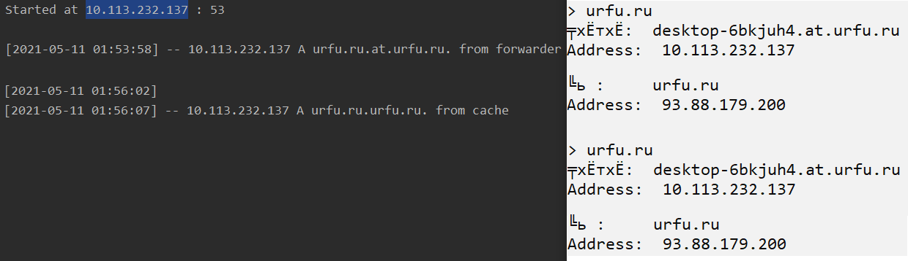

# Caching DNS Server
* Случает 53 UDP порт.

## Требования
* Python версии не ниже, чем 3.6
* IPy

## Запуск сервера
```sh
$ python dns.py [-h] [-p P] [-f F]

-h, --help  show this help message and exit
-p P        server port
-f F        IP:Port for forwarder. Example: 8.8.8.8:53
```

## Пример запуска
```
python dns.py -p 53 -f 8.8.8.8
```

## Пример использования
1. Стартануть сервер
2. Запустить, к примеру, `nslookup`
3. Переключаемся на наш сервер с помощью команды `server [IP нашего сервера]`
4. Делаем запросы


Список типов записей указан в файле resolver.py

